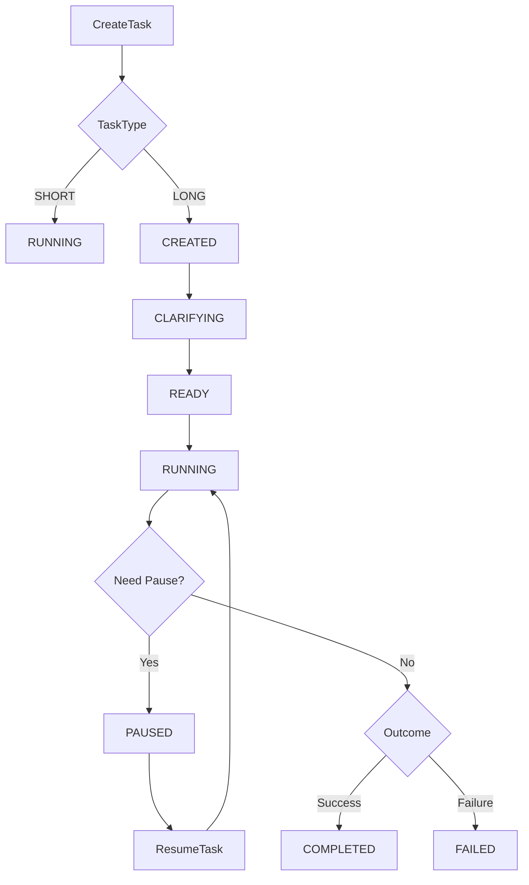
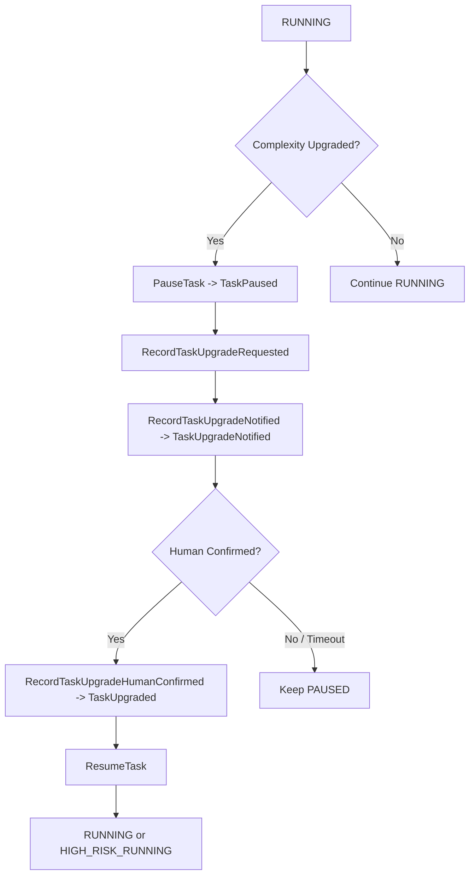
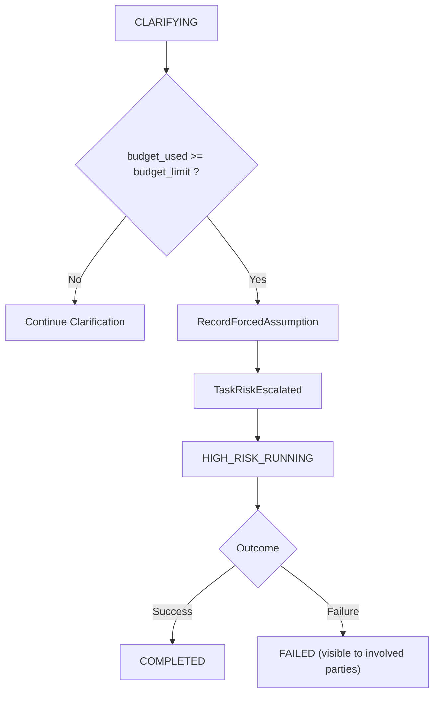
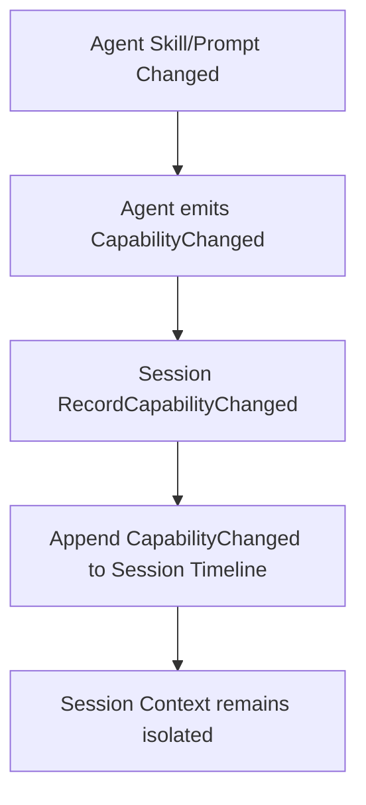
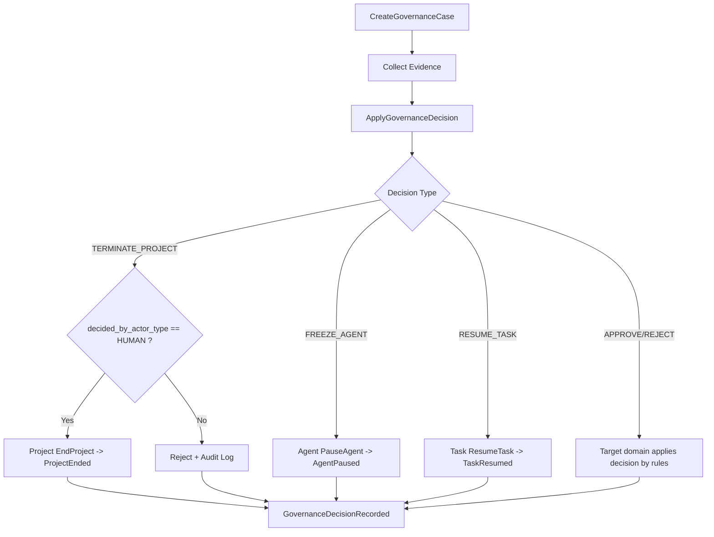
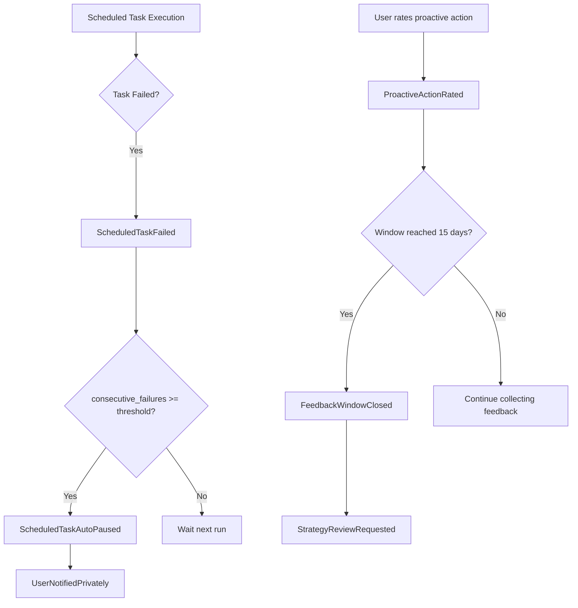
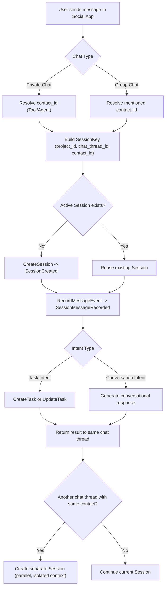
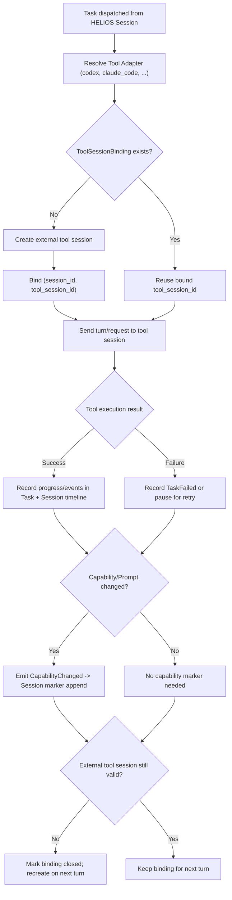

# HELIOS Business Flows v1

## 1. Task 生命周期

### 节点解释
- `CreateTask`：创建任务命令入口，初始化任务聚合和首条事件。
- `TaskType`：分支判断任务类型，`SHORT` 走即时执行，`LONG` 进入完整状态机。
- `CREATED`：长任务创建后的初始状态，尚未完成澄清或就绪判定。
- `CLARIFYING`：任务处于澄清阶段，消耗澄清预算以补齐执行信息。
- `READY`：澄清完成且满足执行前提，可进入执行态。
- `RUNNING`：任务正在执行。
- `Need Pause?`：是否因依赖、升级、外部中断等原因需要暂停。
- `PAUSED`：暂停态，等待恢复命令或治理决策。
- `ResumeTask`：恢复命令，成功后回到执行态。
- `Outcome`：执行结果判断节点。
- `COMPLETED`：任务完成终态，不等于项目终结。
- `FAILED`：任务失败终态，必须可复盘。

## 2. Task 升级三连（Pause -> Notify -> HumanConfirm）

### 节点解释
- `RUNNING`：升级流程触发前，任务处于执行态。
- `Complexity Upgraded?`：判断任务复杂度是否上升到需升级处理。
- `PauseTask -> TaskPaused`：第一步，必须先暂停任务并记录事件。
- `RecordTaskUpgradeRequested`：第二步前置，登记升级请求和升级原因。
- `RecordTaskUpgradeNotified -> TaskUpgradeNotified`：第二步，通知用户并记录通知事件。
- `Human Confirmed?`：第三步门禁，等待用户确认是否继续升级后执行。
- `RecordTaskUpgradeHumanConfirmed -> TaskUpgraded`：第三步，确认后写入升级完成事件。
- `ResumeTask`：升级确认后恢复执行。
- `RUNNING or HIGH_RISK_RUNNING`：恢复后的目标执行态，取决于风险级别。
- `Keep PAUSED`：未确认或超时，保持暂停，禁止隐式继续执行。
- `Continue RUNNING`：未触发升级则沿原路径继续执行。

## 3. 澄清预算耗尽后的高风险执行

### 节点解释
- `CLARIFYING`：任务正在澄清并累计澄清次数。
- `budget_used >= budget_limit ?`：判断是否达到澄清预算上限。
- `Continue Clarification`：预算未耗尽时继续澄清流程。
- `RecordForcedAssumption`：预算耗尽后必须记录“强制假设”。
- `TaskRiskEscalated`：风险升级事件，标记任务进入高风险路径。
- `HIGH_RISK_RUNNING`：高风险执行态，系统不得因理解不足阻塞任务。
- `Outcome`：高风险执行结果判断。
- `COMPLETED`：高风险路径执行完成。
- `FAILED (visible to involved parties)`：失败仅对当事人可见，但必须可复盘。

## 4. Session 能力变化留痕

### 节点解释
- `Agent Skill/Prompt Changed`：Agent 技能或 Prompt 发生版本变化。
- `Agent emits CapabilityChanged`：Agent 域输出能力变化事件。
- `Session RecordCapabilityChanged`：Session 域接收并校验该变化记录。
- `Append CapabilityChanged to Session Timeline`：追加写入会话时间线，禁止覆盖历史。
- `Session Context remains isolated`：变更只作用于当前会话上下文，不污染其他并行会话。

## 5. Governance 决策流（含 Project 终结约束）

### 节点解释
- `CreateGovernanceCase`：创建治理案件，绑定目标域对象与请求原因。
- `Collect Evidence`：补充证据材料用于决策审查。
- `ApplyGovernanceDecision`：执行治理决策命令。
- `Decision Type`：按决策类型分派处理路径。
- `TERMINATE_PROJECT`：项目终结决策分支。
- `decided_by_actor_type == HUMAN ?`：项目终结硬约束校验，只允许人类裁决。
- `Project EndProject -> ProjectEnded`：校验通过后，项目域落地终结事件。
- `Reject + Audit Log`：校验不通过，拒绝并写审计记录。
- `FREEZE_AGENT`：对 Agent 执行冻结动作。
- `RESUME_TASK`：对 Task 执行恢复动作。
- `APPROVE/REJECT`：通用审批分支，由目标域按自身约束执行。
- `GovernanceDecisionRecorded`：统一记录治理决策结果，作为审计闭环。

## 6. 扩展点流程（Scheduled / Proactivity）

### 节点解释
- `Scheduled Task Execution`：定时任务触发执行。
- `Task Failed?`：检查本次执行是否失败。
- `ScheduledTaskFailed`：记录一次定时任务失败事件及连续失败次数。
- `consecutive_failures >= threshold?`：判断是否达到自动暂停阈值。
- `ScheduledTaskAutoPaused`：达到阈值后自动暂停调度。
- `UserNotifiedPrivately`：自动暂停后私聊通知用户，避免群广播噪音。
- `Wait next run`：未达阈值时等待下次调度窗口。
- `User rates proactive action`：用户对主动行为进行赞/踩反馈。
- `ProactiveActionRated`：记录反馈事件。
- `Window reached 15 days?`：判断半月反馈窗口是否闭合。
- `FeedbackWindowClosed`：窗口闭合并形成汇总边界。
- `StrategyReviewRequested`：发起策略复盘请求，进入人类参与优化流程。
- `Continue collecting feedback`：窗口未闭合时持续积累反馈样本。

## 7. 社交 App 交互流（Session = 私聊/群聊）

### 节点解释
- `User sends message in Social App`：用户在社交 App 发起消息，入口可以是私聊或群聊。
- `Chat Type`：识别当前会话形态，决定联系人解析方式。
- `Resolve contact_id (Tool/Agent)`：私聊场景直接确定目标工具联系人。
- `Resolve mentioned contact_id`：群聊场景通过 @ 提及或路由规则定位目标工具联系人。
- `Build SessionKey (project_id, chat_thread_id, contact_id)`：构建会话定位键，确保同一聊天线程与联系人映射到同一 Session。
- `Active Session exists?`：判断是否已有可复用的活跃 Session。
- `CreateSession -> SessionCreated`：不存在时创建新 Session，并写入创建事件。
- `Reuse existing Session`：存在时复用，保持上下文连续。
- `RecordMessageEvent -> SessionMessageRecorded`：所有消息必须追加到会话时间线。
- `Intent Type`：将消息识别为任务意图或普通对话意图。
- `CreateTask or UpdateTask`：任务意图进入 Task 域生命周期。
- `Generate conversational response`：非任务意图走会话响应路径。
- `Return result to same chat thread`：响应必须回到同一私聊/群聊线程。
- `Another chat thread with same contact?`：同一工具联系人在另一个聊天线程触发新协作关系。
- `Create separate Session (parallel, isolated context)`：为新线程建立并行 Session，上下文严格隔离。
- `Continue current Session`：继续在当前 Session 中追加历史。

## 8. 工具 Session 处理流（Codex / Claude Code 等）

### 节点解释
- `Task dispatched from HELIOS Session`：HELIOS 内部任务由某个 Session 派发到具体工具。
- `Resolve Tool Adapter (codex, claude_code, ...)`：根据工具类型选择对应适配器，屏蔽外部协议差异。
- `ToolSessionBinding exists?`：检查当前 HELIOS Session 是否已绑定外部工具 Session。
- `Create external tool session`：无绑定时创建外部工具侧会话。
- `Bind (session_id, tool_session_id)`：建立内部 Session 与外部会话的一对一绑定记录。
- `Reuse bound tool_session_id`：有绑定时复用外部会话，保持连续上下文。
- `Send turn/request to tool session`：向外部工具发送本轮请求。
- `Tool execution result`：接收工具执行结果并进行分支处理。
- `Record progress/events in Task + Session timeline`：成功时写入任务进展与会话时间线事件。
- `Record TaskFailed or pause for retry`：失败时按任务规则记录失败或暂停待重试。
- `Capability/Prompt changed?`：判断本轮是否涉及能力/Prompt 变化。
- `Emit CapabilityChanged -> Session marker append`：能力变化必须在 Session 中追加可审计标记。
- `No capability marker needed`：无能力变化则不写该类标记。
- `External tool session still valid?`：检查外部会话是否可继续使用（未过期/未关闭）。
- `Mark binding closed; recreate on next turn`：外部会话失效时关闭绑定，下轮按需重建。
- `Keep binding for next turn`：外部会话有效则继续复用。

## 9. 说明
- 本文档为业务流程视图，不替代领域模型文档中的状态机与不变量定义。
- 所有流程节点命名对齐以下文档：
  - `/Users/xm/Desktop/work_project/backend/helios_kernel/docs/Domain Model Overview.md`
  - `/Users/xm/Desktop/work_project/backend/helios_kernel/docs/Task Domain Model.md`
  - `/Users/xm/Desktop/work_project/backend/helios_kernel/docs/Session Domain Model.md`
  - `/Users/xm/Desktop/work_project/backend/helios_kernel/docs/Governance Domain Model.md`
  - `/Users/xm/Desktop/work_project/backend/helios_kernel/docs/Rule Extension Points.md`
