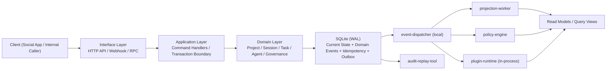
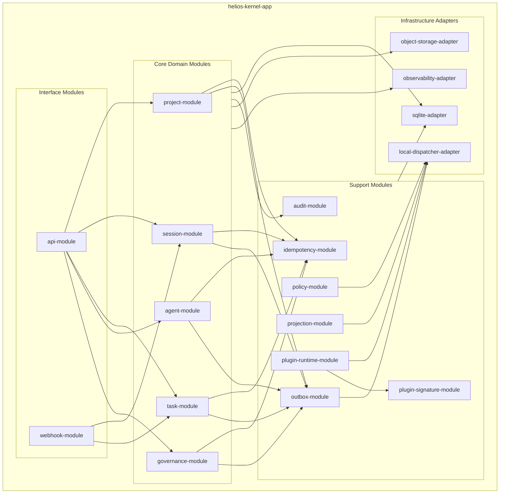

# HELIOS 开发架构与技术栈方案（v1）

## 1. 文档目标
- 基于现有领域文档，给出可落地的实现层架构与技术选型。
- 明确数据写入、读取、审计、回放的流向方案。
- 约束范围仅覆盖 v1，必须不与不可变规格冲突。

## 2. 设计输入与约束
- 必须遵循 `Project / Session / Task / Agent / Governance` 五域模型。
- 必须遵循 `Current State + Immutable Events` 混合模型。
- 所有命令必须携带 `idempotency_key`，并支持幂等重试。
- Task 升级必须遵循 `Pause -> Notify -> HumanConfirm` 三连。
- 澄清预算耗尽后，系统必须进入 `HIGH_RISK_RUNNING`，不得阻塞执行。
- 系统 must 以本地部署为默认形态（个人电脑或个人服务器）。
- 核心数据 must 默认保留在本地，不依赖云端托管组件。

## 3. 总体架构（分层 + 事件驱动）

### 3.1 逻辑分层
1. **Interface Layer（接入层）**
   - 提供 HTTP API / Webhook / 内部 RPC 接口。
   - 负责鉴权、限流、请求格式校验、`correlation_id` 注入。
2. **Application Layer（应用服务层）**
   - 负责命令编排、幂等检查、事务边界控制。
   - 统一执行流程：`校验 -> 状态变更 -> 事件追加`。
3. **Domain Layer（领域层）**
   - 实现聚合根与不变量校验（Project/Session/Task/Agent/Governance）。
   - 只处理业务语义，不依赖具体存储技术。
4. **Infrastructure Layer（基础设施层）**
   - 持久化（本地状态库 + 事件库）、本地事件分发、对象存储、可观测性。
   - 提供 Outbox、审计日志、回放工具、插件签名校验。

### 3.2 运行时组件
- `command-api`：命令入口与同步写入。
- `event-dispatcher`：消费 outbox，将领域事件分发到本地 worker。
- `projection-worker`：构建查询模型与统计视图。
- `policy-engine`：执行治理规则、风险策略、调度扩展点。
- `audit-replay-tool`：按聚合回放事件并生成审计报告。
- `plugin-runtime`：in-process 插件加载与签名校验执行器。

### 3.3 总体架构图（Runtime）


### 3.4 模块架构图（NestJS Monolith v1）


## 4. 技术栈选择（v1 建议）

### 4.1 后端语言与框架
- **首选：TypeScript + NestJS**
  - 理由：
    - 适配命令/事件 DTO 与契约驱动开发。
    - 模块化清晰，便于按领域拆分 bounded context。
    - 团队上手成本较低，开发效率高。
- **备选：Go + Gin/Fiber**
  - 在高并发与低延迟优先场景可替代，但初期开发成本更高。

### 4.2 存储、缓存与本地分发（v1）
- **SQLite（主存储，WAL 模式）**
  - 存储当前状态表 + 事件表 + 幂等表 + outbox 表。
  - 使用事务保证“状态变更 + 事件追加 + outbox 写入”原子性。
  - 默认数据目录 should 为本地目录（例如 `~/.helios/data`）。
- **In-Memory Cache（可选）**
  - 仅用于短期缓存与限流计数，不作为事实来源。
  - 进程重启后丢失不影响正确性。
- **Outbox + 内置 Dispatcher（本地分发）**
  - 承载事件异步分发、投影、策略与插件处理。
  - 单机场景使用本地分发队列即可满足需求，v1 must not 依赖 Kafka/Redis。
- **本地对象存储（文件系统）**
  - 存储 `content_ref / question_ref / evidence_ref` 指向的大文本或附件。
  - 默认目录 should 为 `~/.helios/blobs`。

### 4.3 接口与契约管理
- API 协议建议：`HTTP/JSON`（v1） + OpenAPI。
- 内部事件协议建议：JSON Schema + `schema_version`。
- 契约演进必须遵循向后兼容，新增字段应为可选。

### 4.4 可观测性与运维
- 日志：结构化 JSON（建议 ELK / OpenSearch）。
- 指标：Prometheus + Grafana。
- 链路追踪：OpenTelemetry + Jaeger/Tempo。
- 必须贯通 `command_id / causation_id / correlation_id`。

### 4.5 插件模型（in-process）与签名策略
- 插件运行模型：in-process（与主进程同地址空间）。
- 插件发布包 must 包含：
  - `plugin-manifest.json`
  - `plugin-signature.sig`
  - `plugin-public-key.pem`（或 key id + 本地信任仓库）
- 启动加载前 must 执行签名校验：
  - 校验 `manifest hash`
  - 校验签名与公钥匹配
  - 校验插件 ID、版本、权限声明
- 校验失败 must not 加载插件，并写入 `rejection_audit_logs`。
- 本地信任策略 should 支持：
  - 用户手动信任公钥（allowlist）
  - 插件版本锁定（pin）
  - 签名轮换（key rotation）

## 5. 数据存储模型（逻辑）

### 5.1 必要逻辑表
- `*_current_state`：各聚合当前状态快照（查询优化）。
- `domain_events`：不可变事件总表（或分域事件表）。
- `idempotency_records`：幂等键与结果映射。
- `outbox_events`：待发布事件队列。
- `rejection_audit_logs`：拒绝操作审计记录。
- `plugin_trust_store`：插件签名信任锚、公钥、状态与更新时间。

### 5.2 关键字段约束
- 所有 ID 应使用全局唯一 ID（可映射 UUIDv7）。
- 时间字段必须为 UTC（RFC3339）。
- `domain_events` 必须包含：
  - `event_id`, `event_name`, `aggregate_type`, `aggregate_id`
  - `causation_id`, `correlation_id`, `actor_type`, `actor_id`
  - `aggregate_version`, `schema_version`, `occurred_at`, `payload`

## 6. 数据流向方案

### 6.1 命令写入主链路（强一致）
1. 客户端提交命令到 `command-api`。
2. 应用层校验命令 envelope 与幂等键。
3. 领域层执行业务校验与状态转移。
4. 单事务内完成：
   - 更新 `*_current_state`
   - 追加 `domain_events`
   - 写入 `idempotency_records`
   - 写入 `outbox_events`
5. 返回 `ACCEPTED / REJECTED / NOOP_IDEMPOTENT`。

### 6.2 事件分发链路（最终一致）
1. `event-dispatcher` 拉取未投递 outbox。
2. 投递到本地 dispatcher 通道（内存队列或本地 job 表）。
3. 标记 outbox 已投递（至少一次语义）。
4. 下游 `projection-worker`、`policy-engine`、`plugin-runtime` 订阅处理。

### 6.3 读模型构建链路
- `projection-worker` 消费事件，维护：
  - 项目概览视图（Project + Session 统计）
  - 任务看板视图（按状态、风险、负责人）
  - 治理审计视图（案件、证据、裁决）
- 读模型失败可重放恢复，不影响主写入链路。

### 6.4 高风险与私有失败可见性流向
- 当 Task 进入 `HIGH_RISK_RUNNING` 或 `FAILED`（私有可见）时：
  - 事实事件必须进入 `domain_events`。
  - 对外展示层必须基于 `visibility_scope` 做过滤。
  - 审计工具必须对授权治理角色可回放完整链路。

## 7. 一致性、幂等与恢复策略

### 7.1 一致性策略
- 单聚合命令必须在单事务内提交状态与事件。
- 跨聚合流程采用轻量流程管理器，必须允许补偿。
- 不允许跨域直接写外域状态，只允许发命令或订阅事件。

### 7.2 幂等策略
- 唯一键建议：`(aggregate_id, command_name, idempotency_key)`。
- 同键同 payload 返回 `NOOP_IDEMPOTENT`。
- 同键异 payload 必须拒绝并审计。

### 7.3 灾备与回放
- 事件库必须支持按 `aggregate_id` 全量回放。
- Projection 可随时重建，不得作为唯一事实源。
- 建议启用 SQLite 周期快照备份与本地/异盘加密归档。

## 8. 安全与治理落地要点
- `EndProject` 必须验证 `HUMAN + TERMINATE_PROJECT` 决策。
- 所有拒绝结果必须落审计记录。
- 机密数据不得入事件 payload，必须存对象存储并引用 `*_ref`。
- 应启用细粒度 RBAC，至少区分 `HumanOwner / Collaborator / GovernanceAuditor / Agent`。
- in-process 插件 must 通过签名校验后才可加载执行。
- 插件权限 must 最小化声明，未声明能力 must not 被授予。

## 9. 代码文件结构设计（NestJS v1）

### 9.1 目录结构建议
```text
helios-kernel/
  docs/
  src/
    main.ts
    app.module.ts
    interfaces/
      http/
        controllers/
          project.controller.ts
          session.controller.ts
          task.controller.ts
          agent.controller.ts
          governance.controller.ts
        dto/
          command-envelope.dto.ts
          command-result.dto.ts
      webhook/
        social-app.webhook.ts
    application/
      common/
        command-bus.ts
        transaction-manager.ts
        idempotency.service.ts
      project/
        commands/
        handlers/
      session/
        commands/
        handlers/
      task/
        commands/
        handlers/
      agent/
        commands/
        handlers/
      governance/
        commands/
        handlers/
    domain/
      common/
        base-aggregate.ts
        domain-event.ts
        error-codes.ts
      project/
        project.aggregate.ts
        project.events.ts
      session/
        session.aggregate.ts
        session.events.ts
      task/
        task.aggregate.ts
        task.events.ts
      agent/
        agent.aggregate.ts
        agent.events.ts
      governance/
        governance.aggregate.ts
        governance.events.ts
    infrastructure/
      persistence/
        sqlite/
          entities/
          repositories/
          migrations/
      outbox/
        outbox.publisher.ts
        outbox.dispatcher.ts
      messaging/
        local-dispatcher.adapter.ts
      storage/
        object-storage.adapter.ts
      plugins/
        signature-verifier.ts
        trust-store.repository.ts
        plugin-loader.ts
      observability/
        logger.ts
        tracing.ts
        metrics.ts
    workers/
      projection/
        projection.worker.ts
      policy/
        policy.worker.ts
      replay/
        replay.cli.ts
    read-models/
      project-overview/
      task-board/
      governance-audit/
  test/
    unit/
    integration/
    e2e/
```

### 9.2 文件结构约束
- `domain/` must not 依赖 `infrastructure/`。
- `application/` must 负责事务边界与命令编排，不承载领域规则本体。
- `interfaces/` should only 做协议适配、鉴权、DTO 校验，不应出现业务决策。
- `infrastructure/` must 封装外部系统（SQLite、本地分发、对象存储）细节。
- `workers/` should 通过事件与命令协作，不应绕过应用层直接改聚合状态。
- `plugins/` must 先验签后加载，未签名或验签失败插件 must not 执行。

### 9.3 v1 首批必须落地文件
- `src/interfaces/http/dto/command-envelope.dto.ts`
- `src/interfaces/http/dto/command-result.dto.ts`
- `src/domain/common/error-codes.ts`
- `src/infrastructure/persistence/sqlite/repositories/domain-events.repository.ts`
- `src/infrastructure/persistence/sqlite/repositories/idempotency.repository.ts`
- `src/infrastructure/persistence/sqlite/repositories/outbox.repository.ts`
- `src/infrastructure/outbox/outbox.dispatcher.ts`
- `src/workers/projection/projection.worker.ts`
- `src/infrastructure/plugins/signature-verifier.ts`
- `src/infrastructure/plugins/trust-store.repository.ts`

## 10. 迭代落地路线图（建议）
1. **M1：核心写入闭环**
   - Project/Session/Task 主命令 + 事件落库 + 幂等表 + outbox。
2. **M2：治理与高风险链路**
   - Governance 案件、裁决、`EndProject` 强约束、私有失败可见控制。
3. **M3：插件签名与读模型**
   - 插件签名校验、信任仓库、看板投影、审计回放工具。
4. **M4：扩展点接入**
   - Scheduled / Proactivity 仅按契约接入，不引入算法耦合。

## 11. 与现有规格的一致性检查结论
- 本方案未改变五域边界与状态常量。
- 本方案未放宽 Task 升级三连与澄清预算耗尽规则。
- 本方案保持“Project 仅可由 Human+Governance 终结”的上位约束。
- 本方案将“状态可读 + 事件可审计”作为强制实现要求。
- 本方案以本地优先为前提，核心数据默认保留在用户本地。
